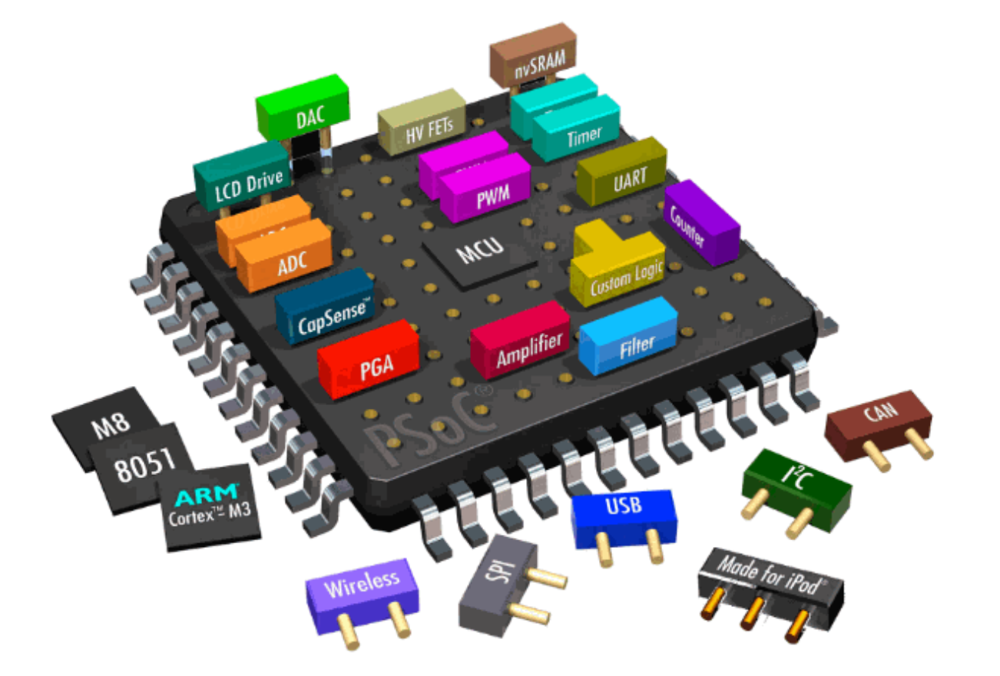
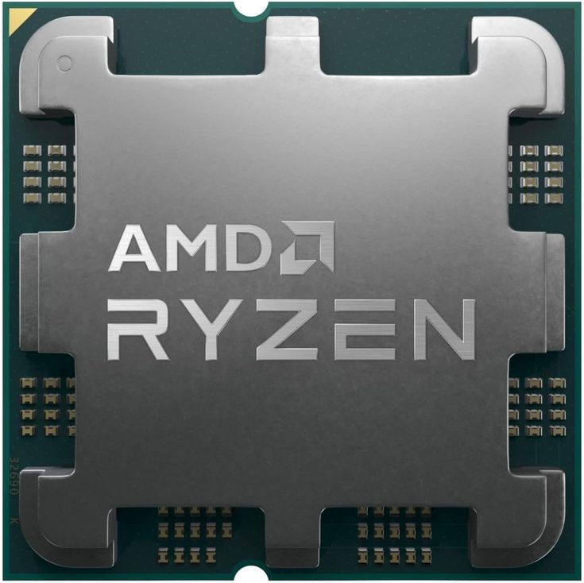
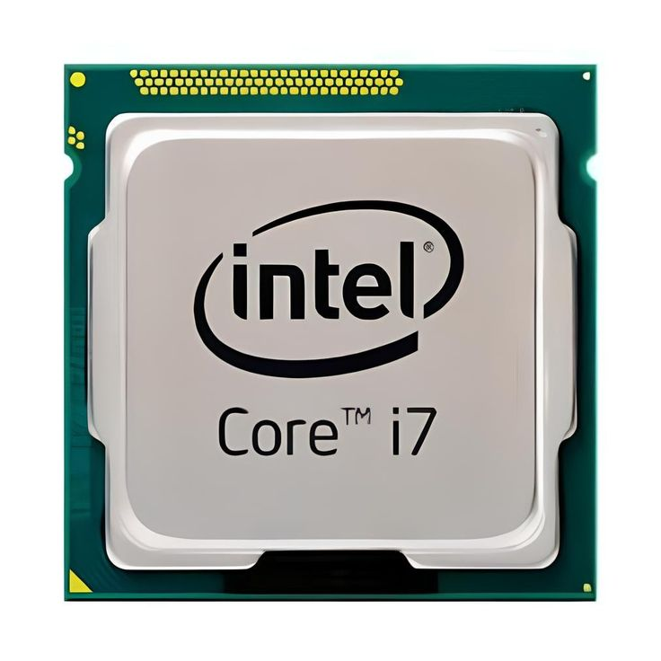
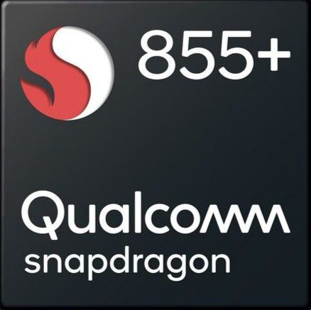
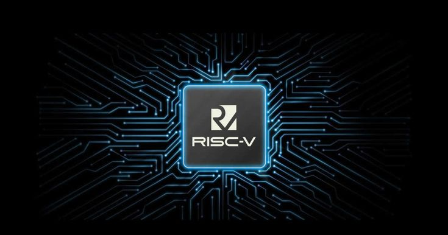
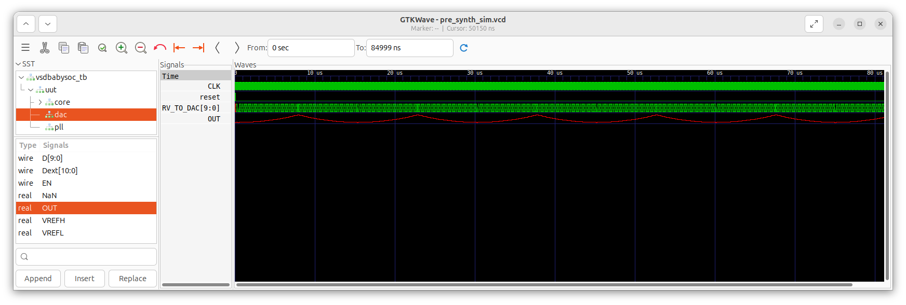
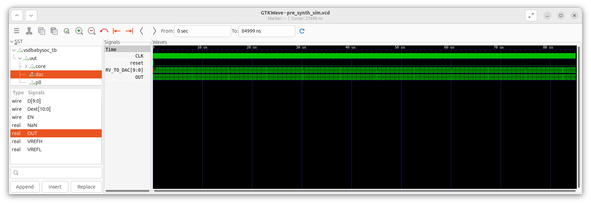
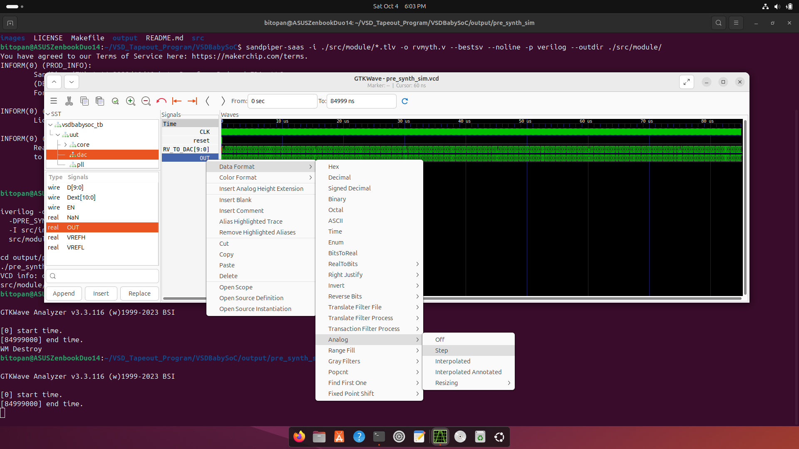

# Week 2: Fundamentals of SoC, Introduction to VSDBabySoC & its Functional Modelling
 
The focus of this week is to understand the fundamentals of System-on-Chip (SoC) design and get hands-on exposure to the VSDBabySoC educational platform. We will start by exploring SoC concepts, computer architecture basics, and the RISC-V instruction set. Then, we will dive into the primary components of VSDBabySoC—RVMYTH CPU, PLL, UART, and DAC—and learn how they interact. Finally, we will perform functional modelling of VSDBabySoC, simulating its behavior using TL-Verilog, Verilog, Icarus, and GTKWave to observe digital and analog outputs. This week blends theoretical understanding with practical simulation experience to build a strong foundation in SoC design.

---

## 📜 Table of Contents
[📋 Prerequisites](#-prerequisites) <br>
[1. Introduction to SoC](#1-introduction-to-soc) <br>
[2. Basics of Computer Architecture](#2-basics-of-computer-architecture) <br>
[3. Introduction to RISC-V](#3-introduction-to-risc-v) <br>
[4. Intellectual Property (IP) Cores in SoCs](#4-intellectual-property-ip-cores-in-socs) <br>
[5. Introduction to VSDBabySoC](#5-introduction-to-vsdbabysoc) <br>
[6. Components of VSDBabySoC](#6-components-of-vsdbabysoc)<br>
[7. Functional Modelling in SoC Design](#7-functional-modelling-in-soc-design)<br>
[8. Functional Modelling of VSDBabySoC](#8-functional-modelling-of-vsdbabysoc)<br>
[⚠️ Challenges](#%EF%B8%8F-challenges)<br>
[🏁 Final Remarks](#-final-remarks)

---

## 📋 Prerequisites
- Basic understanding of Verilog codes.
- Basic understanding of Linux commands.
- Successful installation of the tools shown in [Week 0.](https://github.com/BitopanBaishya/VSD-Tapeout-Program-2025---Week-0.git)

---

## 1. Introduction to SoC.
### <ins>1. What is a System on Chip (SoC)?</ins><br>
  A System on Chip (SoC) is an integrated circuit (IC) that brings together all the essential components of a computer or electronic system onto a single chip. Instead of having separate chips for processor, memory, communication, and input/output, an SoC combines them into one compact unit.
  * A traditional computer may use multiple ICs: one for CPU, one for memory, one for communication, etc.
  * An SoC integrates all these functionalities onto a single silicon die.
  
  *In short, an SoC = a complete mini-computer on a single chip.*
  <br>
  <div align="center">
    
  </div>

### <ins>2. Why are SoCs Important in Modern Electronics?</ins><br>
  SoCs are the backbone of today’s electronics because they offer:
  * **Compact size** → critical for portable devices (smartphones, wearables, IoT gadgets).
  * **High performance** → fast communication between integrated blocks.
  * **Low power consumption** → essential for battery-powered devices.
  * **Cost efficiency** → fewer components, less power, less PCB space.

  That’s why SoCs are found everywhere, from phones and laptops to cars and satellites.

### <ins>3. Real-world Applications of SoCs</ins><br>
  * **Mobile Phones** → Qualcomm Snapdragon, Apple A/M series, Samsung Exynos.
  * **Laptops & Tablets** → Apple M1/M2/M3 chips.
  * **Automotive Systems** → Tesla’s FSD (Full Self Driving) SoC.
  * **IoT Devices** → ESP32, Raspberry Pi Pico.
  * **Game Consoles** → Nintendo Switch (NVIDIA Tegra SoC).
 
  Basically, if you pick up any modern smart device, there’s a good chance it runs on an SoC.

### <ins>4. Types of SoC</ins><br>
System-on-Chip (SoC) designs vary depending on their target applications, complexity, and processing requirements. Broadly, there are three main types of SoCs:
- **Microcontroller-Based SoC**:
  * These SoCs are built around a microcontroller unit (MCU).
  * Features:
    * Integrated CPU, memory (RAM/ROM), and peripherals (timers, GPIO, ADC/DAC).
    * Focused on control-oriented tasks rather than heavy computation.
    * Low power consumption, suitable for IoT devices, wearables, and embedded systems.
  * Example: ARM Cortex-M based SoCs, ESP32, STM32.
- **Microprocessor-Based SoC**:
  * These SoCs are built around a microprocessor core, often more powerful than MCUs.
  * Features:
    * Capable of running complex operating systems (like Linux or RTOS).
    * Higher processing performance, often supports multi-core designs.
    * Typically used in smartphones, tablets, and advanced embedded systems.
  * Example: ARM Cortex-A based SoCs, RISC-V cores for educational or custom high-performance SoCs.
- **Application-Specific SoC (ASIC-based)**:
  * These SoCs are designed for specific applications, optimized for a particular task.
  * Features:
    * May include specialized hardware accelerators for AI, graphics, crypto, or signal processing.
    * High performance and energy efficiency for the intended application.
    * Less flexible, as changing functionality often requires redesigning the hardware.
  * Example: Apple M1 chip, Google TPU (Tensor Processing Unit).

### <ins>5. Components of an SoC</ins><br>
A System-on-Chip is like a small city on silicon, with different parts working together. Here are the main components:
- **CPU Core(s)**:
  * The brain of the SoC, executes instructions.
  * Example: ARM Cortex-A series, RISC-V cores like Rocket or RVMYTH.
- **Memory**:
  * On-chip SRAM (for cache and working memory).
  * DRAM controllers (to interface with external memory).
  * Non-volatile memory controllers (Flash, EEPROM).
- **Clock and Power Management**:
  * PLL (Phase Locked Loop) to generate required frequencies.
  * Clock dividers and power gating to save energy.
- **Communication Interfaces (I/O)**:
  * UART, SPI, I2C: For peripheral communication.
  * PCIe, USB, Ethernet: For high-speed connectivity.
  * GPIOs: General purpose input/output pins.
- **Specialized Accelerators**:
  * Graphics Processing Units (GPU) for rendering.
  * AI/ML accelerators for neural networks.
  * Crypto engines for security.
- **Analog and Mixed-Signal Blocks**:
  * DAC (Digital-to-Analog Converter) and ADC (Analog-to-Digital Converter).
  * Analog PLLs for stable clocks.
  * RF transceivers in wireless SoCs.
- **Bus and Interconnects**:
  * The roads connecting all components.
  * Examples: AMBA (AXI, AHB, APB), NoC (Network-on-Chip).
- **Peripherals**:
  * Timers, watchdogs, interrupt controllers.
  * Provide support for system operation.

### <ins>6. SoC Design Flow</ins><br>
- **SoC Specification**:
  * This is the very first step: defining what the SoC should do.
  * Includes performance targets, power consumption, required peripherals, cost, and fabrication technology.
- **Architecture Design (Hardware/Software Partitioning)**:
  * Here, engineers decide:
    * Which parts should be implemented in hardware (e.g., CPU, memory, PLL, UART).
    * Which parts will run in software (e.g., drivers, control programs).
  * This split is crucial for balancing speed, flexibility, and power.
 
**Hardware Side (Front-End Design)**
- **High-Level Modeling**:
  * The design starts as abstract models (e.g., in C, SystemC, MATLAB).
  * Helps in validating the functionality before writing RTL.
- **RTL Design**:
  * The hardware is described in HDL (Verilog/VHDL) at the Register Transfer Level (RTL).
  * RTL describes how data flows between registers and how logic processes it.
- **Functional Simulation and Verification**:
  * Simulations are run on the RTL to check correctness.
  * Testbenches provide inputs and check outputs.
  * Bugs are fixed before moving further.
- **RTL Synthesis and DFT (Design for Testability)**:
  * RTL code is converted into a gate-level netlist (using synthesis tools).
  * DFT logic (like scan chains, BIST) is added so that the chip can be tested after manufacturing.

**Gate-Level Netlist → Physical Design (Back-End)**
- **Place and Route**:
  * Logic gates are placed physically on the chip floorplan, and wiring is routed between them.
- **Timing Verification and Sign-Off**:
  * Check if the design meets the required clock frequency and timing constraints.
  * Ensures no path is too slow for the target frequency.
- **Physical Verification**:
  * Check for manufacturing rules compliance (DRC/LVS).
  * Ensures layout matches the schematic and can actually be fabricated.
- **Design GDSII**:
  * Final chip layout is generated in GDSII format, the standard file format sent to the foundry. GDSII (Graphic Data System II) is the de facto industry-standard file format for representing the physical layout of an Integrated Circuit (IC) or chip. It is a binary file that serves as the final product of the chip design process, known as tape-out, and is the key data file handed over to a semiconductor foundry for manufacturing.

**Manufacturing & Testing**
- **Manufacturing**:
  * The GDSII is sent to the semiconductor foundry (like TSMC, Intel Foundry, GlobalFoundries).
  * Silicon wafers are fabricated.
- **Post-Silicon Validation and Integration**:
  * The first chips are tested in labs.
  * Validation ensures that the chip works correctly in real-world conditions.
  * If issues are found, engineers may do “re-spins” (design corrections + refabrication).
- **Mass Production**:
  * Once validated, the chip goes into high-volume production.
  * Example: smartphone SoCs (Snapdragon, Apple M-series) reach this stage.

**Software Side**
- **Parallel Track: Software Development**:
  * While hardware is being designed, software teams write the code:
    * Bootloaders.
    * Drivers for peripherals.
    * Operating system support.
    * Applications.
- **Software Testing and Refinement**:
  * Software is tested, often on simulators or FPGA prototypes.
  * Refined iteratively as hardware becomes available.
- **HW/SW Co-Simulation**:
  * Hardware and software are tested together in virtual models or FPGA boards.
  * Ensures the system works as a whole before fabrication.
- **Final Code**:
  * The tested and verified software is delivered along with the chip.
  * This is what actually runs on the SoC once fabricated.

---

## 2. Basics of Computer Architecture.
### <ins>1. What is a CPU Core?</ins><br>
  A CPU core is the brain of the chip. It’s the part that actually executes instructions (like add, subtract, load, store, jump).
  * A CPU may have one core (single-core) or multiple cores (multi-core).
  * Each core can run instructions independently, enabling multitasking.
  
  *Think of a CPU core as a worker that reads a set of commands (program) and does the job step by step.*
  <br>
  
  Examples of CPU cores:
  * **x86-based cores** → Intel’s Core i3/i5/i7/i9 cores, AMD’s Zen cores (used in laptops & desktops).
  * **ARM-based cores** → ARM Cortex-A72 (Raspberry Pi 4), Cortex-A78 (modern smartphones), Cortex-M0 (microcontrollers).
  * **RISC-V cores** → RVMYTH (educational), Rocket Chip (Berkeley), BOOM (out-of-order RISC-V core).
  * **Special-purpose cores** → Tensilica DSP cores (used in audio/video chips).
<br>
  <div align="center">
    
    
    
  </div>

### <ins>2. Instruction Set Architecture (ISA) – Definition and Role.</ins><br>
  The Instruction Set Architecture (ISA) is the “contract” between hardware and software. It defines the set of instructions that a CPU core can understand and execute. In simpler words, the ISA is like the language of the processor. Every program, no matter how high-level it starts (like C, Python, Java), eventually gets translated down into instructions from the ISA that the CPU core can execute.<br>
  * **Difference between ISA, Assembly Language and Machine Code**:
    * The ISA defines what instructions exist (e.g., add, subtract, load, store, branch). It defines the entire collection of possible machine codes, just like a dictionary.
    * Assembly language is a low-level programming language that provides a human-readable, textual representation of the machine codes defined by the ISA.
    * Machine Code is the actual program written using the ISA's instructions. It's a long string of binary data (0s and 1s) that the CPU directly executes. It is a specific instance or a sequence of the instructions in ISA. If an ISA is like the dictionary, a machine code program is like a sentence written using words from that dictionary.

  * **Types of Instructions in an ISA**:    
    * **Integer arithmetic & logic**: Add, subtract, AND, OR, etc.
    * **Memory operations**: Load and store values between registers and memory.
    * **Control flow**: Jump, branch, call, return (for loops, conditions, functions).
    * **Floating-point operations (if supported)**: Addition, multiplication, division on decimal numbers.
    * **Extensions**: Modern ISAs often include extra instruction sets for specialized tasks (e.g., vector operations, encryption, DSP functions).

  * **Examples of ISAs**:   
    * **RISC-V** → Open-source, modular, clean design.
    * **x86 / x86-64** → Used in Intel & AMD processors. Complex and powerful, but more complicated.
    * **ARM** → Used in most smartphones, tablets, and embedded devices. Energy-efficient.

### <ins>3. Instruction Decoding – How Instructions Become Control Signals</ins><br>
  Every CPU core executes instructions defined by its ISA, but the instructions themselves are just binary numbers. The CPU needs to understand what each instruction means and coordinate its internal components to perform the correct operation. This process is called instruction decoding.
  * **Step-by-Step Flow of Instruction Execution**:
    1. **Fetch**:
       * The CPU gets the next instruction from memory (like RAM or instruction cache).
       * Example: A binary instruction `000000101000` is fetched.
    2. **Decode**:
       * The decoder examines the binary instruction and determines:
         * Which operation is requested (e.g., add, load, branch).
         * Which registers are involved.
         * If any immediate values or memory addresses are needed.
       * The decoder then generates control signals for the rest of the CPU:
         * Tell the ALU to perform arithmetic/logic operations like addition.
         * Tell the register file which registers to read or write.
         * Tell the memory unit whether to load or store data.     
    3. **Execute**:
       * The operation is performed using the signals generated by the decoder.
       * Example: ALU adds the values from two registers and sends the result to a target register.
    4. **Memory / Write-back (if needed)**:
       * If the instruction involves memory, the CPU reads or writes data.
       * The result is stored back in the appropriate register.

### <ins>4. Single-Cycle vs Pipelined Processors</ins><br>
  A CPU executes instructions in steps, and the way these steps are organized determines the processor design. Two common designs are single-cycle and pipelined processors.
  * Single-Cycle Processor:
    * In a single-cycle processor, each instruction completes in exactly one clock cycle.
    * That means the fetch, decode, execute, memory access, and write-back all happen within the same cycle.
    * Advantages:
      * Simple to design and understand.
      * Useful for educational or small-scale cores.
    * Disadvantages:
      * The clock cycle must be long enough to accommodate the slowest instruction, which reduces overall speed.
      * No overlap of instructions → lower throughput.     
  * Pipelined Processor:
    * A pipelined processor breaks instruction execution into stages, typically:
      1. Fetch
      2. Decode
      3. Execute
      4. Memory access
      5. Write back
    * Each stage works on a different instruction simultaneously, like an assembly line in a factory.
    * Advantages:
      * Higher throughput → multiple instructions are processed at once.
      * Clock cycle can be shorter because each stage is simpler than executing the full instruction in one cycle.
    * Disadvantages:
      * More complex design (needs hazard handling, forwarding, and branch prediction).
      * Risk of stalls if instructions depend on each other. 

---

## 3. Introduction to RISC-V.
### <ins>1. What is RISC-V?</ins><br>
  RISC-V *(pronounced “risk-five”)* is an open-source Instruction Set Architecture (ISA). RISC stands for Reduced Instruction Set Computing, while V represents the fifth generation of the Reduced Instruction Set Computing (RISC) architectures developed at the University of California, Berkeley.

  <div align="center">
    
  </div>
  
  Key Features of RISC-V:
  * Open-Source
    * Unlike proprietary ISAs such as x86 (Intel/AMD) or ARM, RISC-V is free and open. Anyone can design a CPU core using RISC-V without paying licensing fees.
  * RISC Philosophy (Reduced Instruction Set Computer)
    * The design focuses on having a small set of simple instructions that can execute quickly.
    * Simplicity makes it easier to design efficient cores, especially for education, research, and startups.
  * Modular Design
    * RISC-V has a base instruction set (for basic integer operations).
    * Additional extensions can be added depending on the application, like floating-point math, atomic operations, or vector processing.
  * Scalability
    * Can be used to design anything from tiny microcontrollers to powerful high-performance CPUs.

### <ins>2. Why RISC-V gained so much popularity?</ins><br>
  RISC-V has gained tremendous attention in both academia and industry in recent years. Its popularity comes from a mix of technical strengths and strategic advantages that set it apart from older ISAs like x86 and ARM.
  - Open and Royalty-Free:
    * Anyone can use the RISC-V ISA without paying license fees.
    * This makes it attractive for universities, startups, and developing countries, where cost is a major barrier.
    * In contrast, ARM cores require licensing fees, and x86 is locked to Intel/AMD.
  - Simplicity and Clean Design:
    * RISC-V follows the RISC philosophy → a small, elegant set of instructions.
    * Easier to learn for students, easier to implement for chip designers.
    * Avoids decades of legacy baggage that makes x86 very complex.
  - Modularity and Extensibility:
    * RISC-V has a modular ISA:
      * Base ISA (RV32I, RV64I, RV128I).
      * Optional extensions (floating-point, atomic ops, vector instructions, compressed instructions, etc.).
    * Designers can pick and choose what they need → from tiny IoT chips to high-performance AI processors.
  - Ecosystem and Community Growth:
    * Huge support from universities, open-source communities, and big tech companies (like Google, NVIDIA, Western Digital, Alibaba).
    * Growing number of open-source cores, tools, and compilers.
    * This collective momentum accelerates innovation.
  - Freedom from Vendor Lock-In:
    * With ARM or x86, chip makers depend on Intel/AMD or ARM Holdings.
    * RISC-V gives complete design freedom: companies can customize cores without legal or licensing restrictions.
  - Educational Value:
    * Because it’s simple and open, RISC-V is being adopted worldwide in academic programs.
    * Students and researchers can actually study and modify the architecture, which was nearly impossible with proprietary ISAs.
    * RVMYTH in BabySoC is a direct example of this use in education.
  - Future-Proof:
    * Scales from 32-bit microcontrollers (RV32) to 64-bit desktop/server CPUs (RV64) and even 128-bit experimental processors (RV128).
    * Supports modern computing needs like vector extensions for AI/ML.

*Think of RISC-V as the Linux of hardware: free, open, flexible, and rapidly growing. Just like Linux took over servers and Android, RISC-V is on its way to becoming the foundation for a wide range of processors.*

### <ins>3. Base ISA and Extensions</ins><br>
  One of the most important features of RISC-V is its modular design. Instead of defining one giant, fixed instruction set, RISC-V has a small base ISA and then allows extensions to be added as needed. This keeps it flexible and scalable for different applications.
  - The Base ISA:
    * The base instruction set provides the minimal instructions needed for a processor to function.
    * It defines basic operations like:
      * Integer arithmetic (add, subtract).
      * Logical operations (AND, OR, XOR).
      * Data movement (load, store).
      * Branching (jumps, conditional branches).
    * Variants of Base ISA:
      * **RV32I** → Base integer instruction set for 32-bit processors.
      * **RV64I** → Base instruction set for 64-bit processors.
      * **RV128I** → Experimental 128-bit processors.

        *The “I” stands for Integer, meaning it only supports integer operations.*
  - Extensions:<br>
    Beyond the base ISA, RISC-V provides extensions that can be added depending on application needs.
    * Some common extensions:
      * **M (Multiply/Divide)** → Adds hardware support for multiplication and division.
      * **A (Atomic)** → Adds atomic memory operations (important for multi-core processors).
      * **F (Floating-Point, single-precision)** → For handling decimal numbers (e.g., 1.25).
      * **D (Floating-Point, double-precision)** → Higher precision floating-point.
      * **C (Compressed)** → Reduces instruction size (16-bit encoding), useful in embedded systems.
      * **V (Vector)** → Adds vector processing for AI, graphics, and scientific computing.
  - Modularity in Practice:
    * A small IoT device might only use RV32I + C (integer + compressed instructions) → lightweight and energy-efficient.
    * A supercomputer CPU might use RV64I + MAFDV (integer + multiply/divide, atomics, floating-point, vector).

      This flexibility is why RISC-V can scale from tiny microcontrollers to high-performance processors.

*Think of RISC-V like a customizable pizza base. The base ISA is the plain crust (you can eat it as-is). The extensions are toppings — you add cheese, veggies, or extra sauce depending on your taste (application).*

### <ins>4. Assembly Programming in RISC-V</ins><br>
  Every processor executes machine instructions — binary patterns of 0s and 1s. Writing programs directly in binary would be impractical for humans, so processors provide an assembly language: a human-readable representation of machine instructions. <br>For RISC-V, assembly programming means writing instructions that directly correspond to the RISC-V ISA.
  - What is Assembly Language?
    * Assembly is a low-level programming language where each instruction maps almost one-to-one with a CPU instruction.
    * Instead of writing binary like `0000000001010001`, you write instructions such as `ADD x5, x6, x7`. This means add the contents of registers x6 and x7, and store the result in x5.
  - Registers in RISC-V
    * RISC-V provides a set of general-purpose registers (32 registers, each 32 bits wide in RV32).
    * These are named `x0` to `x31`.
    * Each has a role or convention (for example, `x0` is always zero, `x1` is typically used for return addresses, etc.).
  - Common Instruction Categories

    RISC-V assembly has a small but powerful set of instructions:
    * Arithmetic and Logical Instructions
      * `ADD`, `SUB`, `AND`, `OR`, `XOR`
    * Data Transfer Instructions
      * `LW` (load word from memory)
      * `SW` (store word to memory)
    * Control Flow Instructions
      * `BEQ` (branch if equal)
      * `BNE` (branch if not equal)
      * `JAL` (jump and link)
  - Program Execution Flow
    * Write assembly code (e.g., `ADD x5, x6, x7`).
    * Assembler translates it into machine code (binary instructions).
    * The CPU fetches and decodes these instructions.
    * The core executes them using its datapath (ALU, registers, memory).

---

## 4. Intellectual Property (IP) Cores in SoCs.
### <ins>1. What is an IP (Intellectual Property) Core in VLSI?</ins><br>
  In VLSI design, building a complete chip from scratch is nearly impossible due to its complexity and time constraints. Instead, designers use pre-designed, reusable building blocks, called IP Cores (Intellectual Property Cores).<br>
  An IP core is a pre-verified functional block of logic or design that can be integrated into a larger system-on-chip (SoC). It represents a piece of intellectual property because it is developed, tested, and often licensed by companies or open-source communities.

### <ins>2. Types of IP Cores</ins><br>
- Soft IP
  * Delivered as synthesizable HDL (Verilog/VHDL).
  * Flexible and portable across different technologies.
  * Example: A UART controller described in Verilog.
- Firm IP
  * Provided as a netlist (partially technology-mapped).
  * Balance between flexibility and optimization.
- Hard IP
  * Delivered as a fully placed-and-routed layout (GDSII format).
  * Optimized for a specific technology node, fastest but least flexible.
  * Example: A PLL or memory compiler macro.

### <ins>3. Role of IP Cores in SoC Design</ins><br>
An SoC is essentially an integration of multiple IP cores:
- A CPU core for computation.
- A PLL core for clock generation.
- A UART core for communication.
- A DAC/ADC core for analog interfacing.

*Each IP is like a Lego block, and the SoC designer is the architect who connects them into a full system.*

---

## 5. Introduction to VSDBabySoC.
### <ins>1. What is VSDBabySoC?</ins><br>
  VSDBabySoC is a miniature System-on-Chip (SoC) developed as part of the VLSI System Design (VSD) program. It is an educational SoC project, created with the purpose of helping students, researchers, and enthusiasts understand how different hardware components integrate together on a single chip.<br>
  Unlike complex commercial SoCs (such as those in smartphones or laptops), VSDBabySoC is a scaled-down, simplified design that still demonstrates the essential principles of SoC design.
  <div align="center">
    
  </div>

### <ins>2. Primary Objectives of VSDBabySoC</ins><br>
1. **Integration of Multiple IP Cores**<br>
   VSDBabySoC was designed to test the integration of three open-source IP cores:
   * RVMYTH (RISC-V based CPU core)
   * PLL (Phase-Locked Loop for clock generation)
   * UART (Universal Asynchronous Receiver/Transmitter for serial communication)
2. **Analog Component Calibration**<br>
   Includes a DAC (Digital-to-Analog Converter) that generates analog waveforms from digital values produced by the CPU. This allows testing of mixed-signal behavior (digital + analog).
3. **Educational Demonstration**<br>
   Provides hands-on exposure to:
   * CPU instruction execution (via RVMYTH).
   * On-chip communication (via UART).
   * Clock generation and management (via PLL).
   * Digital-to-analog conversion (via DAC).

### <ins>3. Architecture Overview of VSDBabySoC</ins><br>
The architecture of VSDBabySoC is designed to be simple yet representative of real-world SoCs. It integrates digital, analog, and communication blocks on a single chip, demonstrating the fundamental principles of system integration.<br>At a high level, the SoC consists of:
1. **RVMYTH CPU Core – The brain of the system.**
   * Executes instructions and controls the overall system.
   * Stores values in registers and sends them to peripherals like the DAC.
2. **PLL (Phase Locked Loop) – Clock generator and frequency stabilizer.**
   * Provides a stable, high-frequency clock signal.
   * Ensures that the CPU, UART, and DAC operate in synchrony.
   * Without the PLL, the chip would lack timing precision.
3. **UART (Universal Asynchronous Receiver/Transmitter) – Communication interface.**
   * Connects the SoC to the outside world.
   * Used for debugging, data transfer, and receiving instructions.
   * Enables programmers to communicate with the chip via a serial terminal.
4. **DAC (Digital-to-Analog Converter) – For analog waveform generation.**
   * Converts digital output values from the CPU into analog signals.
   * Demonstrates mixed-signal integration.

### <ins>4. Interaction Between Components</ins><br>
- The PLL generates the clock → drives the CPU, UART, and DAC.
- The CPU (RVMYTH) executes instructions → produces data (e.g., waveform values).
- These values are sent to the DAC, which converts them to analog signals.
- Simultaneously, the UART allows external devices (like a PC) to communicate with the CPU → sending/receiving data for testing or control.

---

## 6. Components of VSDBabySoC.
### <ins>1. RVMYTH CPU Core</ins><br>
The RVMYTH CPU core is the central processing unit of the VSDBabySoC. It is a RISC-V based, single-cycle processor designed for simplicity and educational purposes. Despite its small size, it demonstrates all the essential aspects of a modern CPU core—fetching, decoding, and executing instructions, handling registers, and interacting with peripherals.<br>RVMYTH not only powers the logic inside VSDBabySoC but also showcases the fundamental principles of processor design in the RISC-V ecosystem.
- **What is RVMYTH?**
  * RVMYTH is a minimalistic RISC-V CPU core.
  * It is based on the RV32I instruction set architecture (ISA), which supports 32-bit instructions and registers.
- **Single-Cycle Design and Purpose**<br>
  The RVMYTH CPU core is built as a single-cycle processor. This means that each instruction is fetched, decoded, and executed within one clock cycle.
  * How it works:
    * On every rising edge of the clock (from the PLL), the CPU completes one full instruction cycle.
    * This makes the design easy to understand and debug, as there are no complex pipelining or hazards.
  * Purpose of single-cycle design:
    * Simplicity: Ideal for learning and demonstration.
    * Deterministic behavior: One clock → one instruction, so execution timing is straightforward.
    * Tradeoff: It’s slower than pipelined processors, but speed is not the main goal here. The goal is clarity and educational value.
- **Register Usage**<br>
The CPU core contains a set of general-purpose registers (GPRs), typically 32 registers (`r0` to `r31`) as defined by the RISC-V ISA. Each register can hold 32-bit data, which the CPU uses for computation and communication with peripherals.
  * **Special focus: Register `r17`**
    * In VSDBabySoC, the `r17` register plays a unique role.
    * The CPU loads digital values (e.g., waveform samples, numeric data) into `r17`.
    * These values are then sent to the DAC (Digital-to-Analog Converter). This makes the design predictable: whenever `r17` is updated, the DAC knows that a new data value is ready for conversion.
    * The DAC converts them into a continuous analog signal, such as a sine wave or audio signal.

### <ins>2. PLL – Phase-Locked Loop</ins><br>
The Phase-Locked Loop (PLL) in VSDBabySoC is one of the three primary IP cores integrated into the design. While the CPU and DAC handle digital computation and analog conversion, the PLL ensures that everything operates in perfect timing by generating the necessary clock signals. In essence, without a stable clock, the SoC cannot function reliably. The PLL acts as the timekeeper of the system.
- **What is PLL?**<br>
  A Phase-Locked Loop (PLL) is an electronic circuit that:
  1. Takes an input clock signal (from an external crystal oscillator, for example).
  2. Multiplies or divides its frequency.
  3. Outputs a new, stable clock signal that is synchronized (phase-locked) to the input clock.
- **Why Clock Generation/Division is Required?**<br>
  Digital circuits (like the RVMYTH CPU) and analog circuits (like the DAC) need clocks to work, but each has different frequency requirements.
  * CPU: Needs a relatively fast clock (tens of MHz) to execute instructions efficiently.
  * UART: Needs a slower clock (like a few kHz or MHz) to match data communication speed.
  * DAC: May require a steady sampling clock to convert digital values smoothly into analog signals.
  Instead of having multiple external clock sources, the SoC uses:
  * One master clock input (like 10 MHz).
  * A PLL that generates higher frequencies (like 80 MHz).
  * Clock dividers to create the slower required frequencies for UART, DAC, or memory.
- **The 8× PLL Used in VSDBabySoC**<br>
  * **Meaning of 8× PLL:**<br>
    If the input clock is f_in, the PLL outputs f_out = 8 × f_in.
  * **Why 8× specifically?**<br>
    * It gives the CPU (RVMYTH) a fast enough clock to demonstrate meaningful execution speed.
    * The higher-frequency clock can then be divided down to slower clocks for the DAC and UART.

### <ins>3. UART – Universal Asynchronous Receiver-Transmitter</ins><br>
The UART (Universal Asynchronous Receiver-Transmitter) is one of the most widely used communication interfaces in digital systems. In VSDBabySoC, the UART core serves as the primary communication bridge between the SoC and the external world (like a PC).
- **What is UART?**<br>
  * A UART is a hardware module used for serial communication.
  * It sends and receives data one bit at a time over a single wire (TX for transmit, RX for receive), unlike parallel communication where multiple bits travel together.
  * “Asynchronous” means it doesn’t share a clock line with the receiver—both sides just agree on a baud rate (bits per second).
  * Key Features:
    * Simplicity: only needs 2 lines (TX, RX).
    * Widely supported: found in almost every microcontroller, SoC, or PC.
    * Useful for low-to-medium speed communication (commonly 9600, 115200 baud, etc.).
- **Role in Communication – Debugging, Data Transfer**<br>
  The UART plays two critical roles in SoCs like BabySoC:
  * Debugging:
    * When developing and testing the CPU (RVMYTH), designers need to know:
      * Is the CPU running instructions correctly?
      * What are the register values or memory contents?
    * UART provides a simple way to “print out” this information to a PC terminal.
  * Data Transfer:
    * Apart from debugging, UART can be used to send/receive real data between the SoC and external devices.
- **Integration in SoC**<br>
  In VSDBabySoC, the UART is tightly integrated as one of the three main IP cores (alongside RVMYTH and PLL).
  * **How it fits in:**
    1. The CPU (RVMYTH) generates digital data (instructions, register values, or processed outputs).
    2. This data can be sent to the UART module, which converts it into a serial bitstream.
    3. The serial data is sent out on the TX pin to an external device like a PC.
    4. Likewise, external inputs (commands/data) can be received via the RX pin, processed by UART, and fed back to the CPU.

### <ins>4. DAC – Digital-to-Analog Converter</ins><br>
The Digital-to-Analog Converter (DAC) in VSDBabySoC is the bridge between digital computation and the analog world. While CPUs and digital blocks work exclusively with binary numbers, most real-world systems (audio, video, sensors) are analog in nature. The DAC enables BabySoC to output real analog signals that can be interpreted by external devices.
- **What is DAC?**<br>
  * A Digital-to-Analog Converter (DAC) takes a digital binary value (e.g., `1010110010`) and produces an equivalent analog voltage or current.
  * The output analog level is proportional to the digital input value.
  * For example:
    * If the DAC is 10-bit, it can represent `2^10 = 1024` discrete voltage levels between 0 V and its maximum output (say 1 V).
    * Digital value `0000000000` → 0 V,
    * Digital value `1111111111` → Max voltage,
    * Middle value `1000000000` → Half of max voltage.
- **10-bit DAC in BabySoC**<br>
  In VSDBabySoC, a 10-bit DAC is implemented.
  * Why 10-bit?
    * 10 bits → 1024 distinct output voltage levels → fairly smooth analog signal.
    * It’s a sweet spot: not too complex for a teaching SoC, but enough resolution to demonstrate waveform generation and multimedia output.
  * Role in BabySoC:
    * Used to generate analog waveforms (like a sine wave or audio signals).
    * Demonstrates how digital computations can drive real-world analog outputs.
- **How RVMYTH Drives the DAC (`r17` Register to Analog Output)**<br>
  * The RVMYTH CPU core is programmed to sequentially update register r17 with digital values.
  * These values are then fed into the DAC.
  * As the CPU cycles through a pattern (for example, sine wave values stored in memory), r17 is updated continuously.
- **`OUT` File Generation in Simulation**<br>
  When simulating BabySoC, the DAC’s analog output is not directly fed into real hardware. Instead:
  * The DAC’s generated values are saved into a file named `OUT` during simulation.
  * This `OUT` file contains the analog-equivalent waveform data.
  * The file can then be:
    * Plotted on a graph (to visualize the waveform, e.g., a sine wave).
    * Fed into external tools or devices (like simulation software for TV/mobile phone inputs) to mimic real-world usage.

---

## 7. Functional Modelling in SoC Design.
### <ins>1. Introduction to Functional Modelling</ins><br>
Functional modelling represents the *logical behavior* of an SoC without getting into its actual physical implementation or timing delays. It’s the first phase in verifying whether the integrated design of CPU, memory, and peripherals behaves as expected.<br>*You can think of it as running your chip’s “imagination” — it doesn’t yet exist in silicon, but its brain already works in simulation.*

### <ins>2. Purpose of Functional Modelling</ins><br>
The main goals of functional modelling are:
- To verify that all modules (CPU, DAC, PLL, etc.) communicate correctly.
- To validate data flow, control signals, and synchronization at a logical level.
- To catch design bugs early, before synthesis or physical design.
- To develop and test software/firmware even before the chip is fabricated.

### <ins>3. Levels of Modelling</ins><br>
In SoC design, there are multiple abstraction layers:
| Modelling Type | Description |
| :---: | :---: |
| Behavioral / Functional | Describes what the system does |
| RTL (Register Transfer Level) | Adds timing and clock behavior |
| Gate-Level | Describes logic gates and interconnections |
| Physical / Layout | Represents placement, routing, parasitics |

---

## 8. Functional Modelling of VSDBabySoC.
### <ins>1. Flow of Modelling</ins><br>
```
TL-Verilog (RVMYTH)  →  Verilog (via SandPiper)
                              ↓
        +----------------------+
        |   vsdbabysoc.v (Top) |
        +----------------------+
                 ↓
          +--------------+
          | avsdpll.v    |
          | avsddac.v    |
          +--------------+
                 ↓
         Testbench → Simulation (Icarus)
                 ↓
         Output Waveforms (GTKWave)

```
Explanation:
* The RVMYTH core is first compiled from TL-Verilog to Verilog using SandPiper.
* The top-level `vsdbabysoc.v` integrates RVMYTH, the DAC, and PLL.
* The testbench applies stimuli and clocks.
* Simulation results are analyzed using GTKWave to verify behavior.

### <ins>2. Setup/Installations before Simulation</ins><br>
- **Clone the Github Repository**:<br>
  Clone the Github Repository inside any arbitrary folder of your choice:
  ```
  git clone https://github.com/manili/VSDBabySoC.git
  cd VSDBabySoC/
  ```
- **Make another directory inside VSDBabySoC**:
  ```
  mkdir output
  ```
- **Final Directory Structure**:
  ```
  VSDBabySoC/
  ├── src/
  │   ├── include/                       # All the required header files (*.vh) are here
  │   │   ├── sandpiper.vh
  │   │   └── other header files...         
  │   ├── module/                        # All the required .v and .tlv files are here
  │   │   ├── vsdbabysoc.v               # Top-level module integrating all components
  │   │   ├── rvmyth.v                   # RISC-V core module (CPU)
  │   │   ├── avsdpll.v                  # PLL module (Clock)
  │   │   ├── avsddac.v                  # DAC module (Digital to Analog Converter)
  │   │   └── testbench.v                # Testbench for simulation
  └── output/                            # All the outputs after simulation will be stored here
  ```
- **Installation of Sandpiper-Saas**:<br>
  * **Installing prerequisites**:
    ```
    sudo apt update
    sudo apt install python3-venv python3-pip
    ```
  * **Creating and activating a virtual environment**:
    ```
    python3 -m venv vsd_env
    source vsd_env/bin/activate
    ```
  * **Installing SandPiper and dependencies**:
    ```
    pip install pyyaml click sandpiper-saas
    ```
    
### <ins>3. Conversion of `.tlv` files to `.v` files</ins><br>
Since the `rvmyth.tlv` file is written in TL-Verilog, we need to convert it to verilog file (`rvmyth.v`) before simulation.
```
sandpiper-saas -i ./src/module/*.tlv -o rvmyth.v --bestsv --noline -p verilog --outdir ./src/module/
```

Explanation:
* `-i ./src/module/*.tlv` → input all `.tlv` files from the src/module directory.
* `-o rvmyth.v` → main output Verilog file name.
* `--bestsv` → tells SandPiper to generate SystemVerilog-compliant output (best quality for modern simulators).
* `--noline` → removes extra debugging line markers (\line`) that sometimes confuse simulators like Icarus.
* `-p verilog` → target output language (plain Verilog).
* `--outdir ./src/module/` → specify where to place the generated Verilog files.

After this command, the `.v` files of the RVMYTH core can be found inside the `.../src/modules/` directory.

### <ins>4. Pre-synthesis Simulation</ins><br>
```
mkdir -p output/pre_synth_sim

iverilog -o output/pre_synth_sim/pre_synth_sim.out \
  -DPRE_SYNTH_SIM \
  -I src/include -I src/module \
  src/module/testbench.v

cd output/pre_synth_sim
./pre_synth_sim.out
```
Explanation:
| Step | Command Breakdown | Purpose|
| :--- | :--- | :--- |
| 1 | `mkdir -p output/pre_synth_sim` | Create directory for simulation files |
| 2 | `iverilog ...` | Compile Verilog design + testbench |
| 3 | `-DPRE_SYNTH_SIM` | Define macro for conditional simulation |
| 4 | `-I` options | Tell compiler where to find include files |
| 5 | `src/module/testbench.v` | Main simulation input (testbench) |
| 6 | `cd output/pre_synth_sim` | Move to output folder |
| 7 | `./pre_synth_sim.out` | Run simulation executable |

### <ins>5. Observation in GTKWave</ins><br>
```
gtkwave pre_synth_sim.vcd
```
The observed output is as follows:
<div align="center">
  
</div>

> [!CAUTION]
> 1. **Multiple OUT Signals in GTKWave**:
>    While analyzing the waveform, you may notice several `OUT` signals in the signal list. Only the `OUT` signal belonging to the `dac` module should be used for observation. You can find it under the hierarchy: <br>`vsdbabysoc_tb → UUT → DAC → OUT`. <br>See below for reference:
>    <div align="center">
>      
>    </div>
>
> 2. **Analog Waveform Not Visible Initially**:
>    The` OUT` signal, even when correctly selected, will initially not appear as Analog signal. To visualize the analog-equivalent output, you need to change its data representation:
>    * Right-click on the `OUT` signal in the waveform list.
>    * Navigate to Data Format → Analog → Step.
>
>    After this conversion, the waveform will resemble a continuous analog signal corresponding to the digital input values. See below for reference:
>    <div align="center">
>      
>    </div>

### <ins>6. Analysis of the observations</ins><br>
The pre-synthesis simulation of the VSDBabySoC design was performed successfully using Icarus Verilog and visualized on GTKWave. The simulation included the integrated subsystems — RVMYTH core, DAC, and PLL — interacting under the testbench environment.

- **Observation of Signal Hierarchy**:<br>
  Within GTKWave, the hierarchy tree under `vsdbabysoc_tb → uut` reveals the internal connections of the SoC:
  * The core generates the 10-bit digital output `RV_TO_DAC[9:0]`.
  * The DAC module receives this signal and produces a corresponding real-valued output (`OUT`), representing the analog equivalent of the digital data.
  * The PLL block stabilizes the system clock used across modules.

- **Digital-to-Analog Transition**:<br>
  The signal `RV_TO_DAC[9:0]` appears as a dense, rapidly switching digital pattern — this is expected, as it carries high-frequency digital codes generated by the RISC-V core.<br>
  Meanwhile, the `OUT` signal (when converted to analog format) forms a smooth, continuous waveform — an elegant transformation of the discrete digital codes into their analog voltage representation.<br>
  This verifies that:
  * The DAC module is functioning correctly, converting the 10-bit binary input to a proportional analog value.
  * The waveform shape (smooth red curve) indicates the variation in analog output as the digital input toggles through successive values.

- **How Digital Data Becomes Analog — The Role of `r17`**:<br>
  At the heart of the VSDBabySoC, the RVMYTH RISC-V core acts as the digital brain. Among its many registers, the `r17` register plays a special role — it holds the digital value that will be sent to the DAC.<br>
  During program execution, the RISC-V core continuously updates the value in `r17`. This register’s 10 least significant bits (LSBs) are routed to the `RV_TO_DAC[9:0]` bus — the digital pathway leading directly into the DAC module. Inside the DAC, this 10-bit digital input is converted into a proportional analog voltage using a resistor network model (or its behavioral equivalent in Verilog). Mathematically, this can be represented as:<br>

$$
V_{OUT} = \frac{Digital\ Value}{2^{10}-1} \times (V_{REFH} - V_{REFL}) + V_{REFL}
$$


  Where:<br>
  * *Digital Value* is the binary input from `r17[9:0]`
  * *V<sub>REFH</sub>* and *V<sub>REFL</sub>* are the high and low reference voltages
  * *V<sub>OUT</sub>* is the analog output corresponding to that digital code

  As the RISC-V core updates `r17` periodically, the DAC output (`OUT`) varies continuously, creating the smooth analog waveform seen in the simulation. Thus, `r17` serves as the bridge between the digital computation world and the analog behavior of the SoC — translating processor data into real-world analog signals.

- **Functional Validation**:<br>
  From the waveform:
  * The `CLK` and `reset` signals behave as expected — periodic clock pulses with a stable reset phase.
  * The `RV_TO_DAC` changes synchronously with the clock, confirming proper core-to-DAC communication.
  * The `OUT` waveform responds dynamically to these digital transitions, maintaining the correct analog correspondence.

    Thus, the data flow from RVMYTH → DAC → OUT is validated, confirming the functional correctness of the SoC before synthesis.

- **Insights**:<br>
  * The gradual rise and fall of the analog curve represent digital ramp sequences generated by the RISC-V processor.
  * The system demonstrates temporal coherence — meaning digital transitions directly affect analog output timing.
  * The SoC achieves functional integrity, verifying all inter-module handshakes before hardware-level synthesis.

---

## ⚠️ Challenges

- **Multiple `OUT` Signals in GTKWave**
  * **Problem:**<br>
    While analyzing the simulation results in GTKWave, multiple `OUT` signals appeared in the signal tree. This made it confusing to identify which one corresponded to the DAC output.

  * **Cause:**<br>
    The `OUT` signal name is reused or propagated across several modules (e.g., within the top-level testbench, the DAC, and possibly submodules). GTKWave lists all instances, so without careful inspection, you might end up viewing the wrong one.

  * **Solution:**<br>
    Expand the signal hierarchy in GTKWave as: `vsdbabysoc_tb → uut → dac → OUT` <br>
    This path ensures that you’re viewing the actual analog output of the DAC module. Selecting this particular signal displays the correct waveform behavior expected from the digital-to-analog conversion.

- **Output Appearing as Digital Values Instead of Analog Waveform**
  * **Problem:**<br>
    The `OUT` signal initially displayed as binary values, even though it was supposed to represent a continuous analog waveform.

  * **Cause:**<br>
    GTKWave, by default, plots all signals in a binary digital format. The DAC’s `OUT` signal, being of type real, needs manual conversion to visualize its analog nature.

  * **Solution:**<br>
    In GTKWave:<br>
    1. Right-click on the `OUT` signal.
    2. Go to Data Format → Analog → Step.
    3. The waveform now appears as a smooth analog curve, clearly showing the variation of the DAC output voltage with time.


---

## 🏁 Final Remarks
Week 2 represents a deeper dive into the world of SoC design, moving beyond basic RTL and synthesis concepts into the realm of integrated systems, RISC-V architecture, and functional modelling. This week primarily focused on:<br>
- Understanding the architecture and significance of System-on-Chip (SoC), including its components, design flow, and real-world applications.
- Exploring the fundamentals of computer architecture, CPU cores, instruction decoding, and single-cycle versus pipelined processors.
- Learning the RISC-V ISA, its modular design, assembly programming, and how RVMYTH serves as an educational core in BabySoC.
- Grasping the concept of Intellectual Property (IP) cores and their role in SoC integration.
- Gaining hands-on experience with VSDBabySoC, understanding its architecture, key IP cores (RVMYTH, PLL, UART, DAC), and the interactions between them.
- Implementing functional modelling for the SoC, including TL-Verilog to Verilog conversion, pre-synthesis simulation, and waveform observation with GTKWave.

Along the way, several challenges were encountered: from setting up SandPiper-Saas and resolving TL-Verilog to Verilog conversion issues, to understanding timing and data flow between IP cores, and debugging waveform outputs in GTKWave. Each of these obstacles reinforced the importance of precise configuration, careful signal tracing, and thorough validation at the functional level before synthesis.<br>
By the end of this week, the progression from understanding SoC theory to executing functional modelling of VSDBabySoC highlights the essence of system-level design: it is not just about writing RTL, but about ensuring that the entire system—digital, analog, and communication blocks—works harmoniously in simulation. This foundation sets the stage for more advanced design, verification, and eventual synthesis, emphasizing that designing a chip is as much an art of integration and verification as it is of coding.


>[!IMPORTANT]
> For easy navigation to all the weeks of the program, please visit the [Master Repository](https://github.com/BitopanBaishya/VSD-Tapeout-Program-2025.git).


