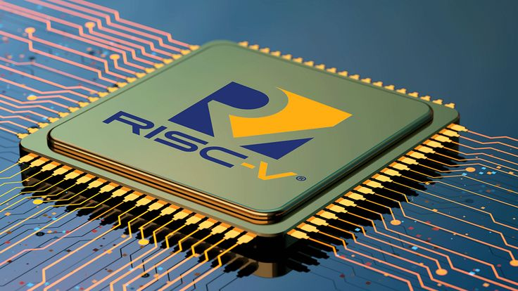

# Week 2: Fundamentals of SoC, Introduction to VSDBabySoC & its Functional Modelling
 
The focus of this week is 

---

## 📜 Table of Contents
[📋 Prerequisites](#-prerequisites)  
[1. Introduction](#1-introduction)  
[2. Basics of Computer Architecture](#2-basics-of-computer-architecture)  
[3. Introduction to RISC-V](#3-introduction-to-risc-v)  
[📋 Prerequisites](#-prerequisites)  

---

## 📋 Prerequisites
- Basic understanding of Verilog codes.
- Basic understanding of Linux commands.
- Successful installation of the tools shown in [Week 0.](https://github.com/BitopanBaishya/VSD-Tapeout-Program-2025---Week-0.git)

---

## 1. Introduction.
### <ins>1. What is a System on Chip (SoC)?</ins> 
  A System on Chip (SoC) is an integrated circuit (IC) that brings together all the essential components of a computer or electronic system onto a single chip. Instead of having separate chips for processor, memory, communication, and input/output, an SoC combines them into one compact unit.
  * A traditional computer may use multiple ICs: one for CPU, one for memory, one for communication, etc.
  * An SoC integrates all these functionalities onto a single silicon die.
  
  *In short, an SoC = a complete mini-computer on a single chip.*
   
  

    
  

### <ins>2. Why are SoCs Important in Modern Electronics?</ins> 
  SoCs are the backbone of today’s electronics because they offer:
  * **Compact size** → critical for portable devices (smartphones, wearables, IoT gadgets).
  * **High performance** → fast communication between integrated blocks.
  * **Low power consumption** → essential for battery-powered devices.
  * **Cost efficiency** → fewer components, less power, less PCB space.

  That’s why SoCs are found everywhere, from phones and laptops to cars and satellites.

### <ins>3. Real-world Applications of SoCs</ins> 
  * **Mobile Phones** → Qualcomm Snapdragon, Apple A/M series, Samsung Exynos.
  * **Laptops & Tablets** → Apple M1/M2/M3 chips.
  * **Automotive Systems** → Tesla’s FSD (Full Self Driving) SoC.
  * **IoT Devices** → ESP32, Raspberry Pi Pico.
  * **Game Consoles** → Nintendo Switch (NVIDIA Tegra SoC).
 
  Basically, if you pick up any modern smart device, there’s a good chance it runs on an SoC.

---

## 2. Basics of Computer Architecture.
### <ins>1. What is a CPU Core?</ins> 
  A CPU core is the brain of the chip. It’s the part that actually executes instructions (like add, subtract, load, store, jump).
  * A CPU may have one core (single-core) or multiple cores (multi-core).
  * Each core can run instructions independently, enabling multitasking.
  
  *Think of a CPU core as a worker that reads a set of commands (program) and does the job step by step.*
   
  
  Examples of CPU cores:
  * **x86-based cores** → Intel’s Core i3/i5/i7/i9 cores, AMD’s Zen cores (used in laptops & desktops).
  * **ARM-based cores** → ARM Cortex-A72 (Raspberry Pi 4), Cortex-A78 (modern smartphones), Cortex-M0 (microcontrollers).
  * **RISC-V cores** → RVMYTH (educational), Rocket Chip (Berkeley), BOOM (out-of-order RISC-V core).
  * **Special-purpose cores** → Tensilica DSP cores (used in audio/video chips).
 
  

    
    
    
  

### <ins>2. Instruction Set Architecture (ISA) – Definition and Role.</ins> 
  The Instruction Set Architecture (ISA) is the “contract” between hardware and software. It defines the set of instructions that a CPU core can understand and execute. In simpler words, the ISA is like the language of the processor. Every program, no matter how high-level it starts (like C, Python, Java), eventually gets translated down into instructions from the ISA that the CPU core can execute. 
  * **Difference between ISA, Assembly Language and Machine Code**:
    * The ISA defines what instructions exist (e.g., add, subtract, load, store, branch). It defines the entire collection of possible machine codes, just like a dictionary.
    * Assembly language is a low-level programming language that provides a human-readable, textual representation of the machine codes defined by the ISA.
    * Machine Code is the actual program written using the ISA's instructions. It's a long string of binary data (0s and 1s) that the CPU directly executes. It is a specific instance or a sequence of the instructions in ISA. If an ISA is like the dictionary, a machine code program is like a sentence written using words from that dictionary.

  * **Types of Instructions in an ISA**:    
    * **Integer arithmetic & logic**: Add, subtract, AND, OR, etc.
    * **Memory operations**: Load and store values between registers and memory.
    * **Control flow**: Jump, branch, call, return (for loops, conditions, functions).
    * **Floating-point operations (if supported)**: Addition, multiplication, division on decimal numbers.
    * **Extensions**: Modern ISAs often include extra instruction sets for specialized tasks (e.g., vector operations, encryption, DSP functions).

  * **Examples of ISAs**:   
    * **RISC-V** → Open-source, modular, clean design.
    * **x86 / x86-64** → Used in Intel & AMD processors. Complex and powerful, but more complicated.
    * **ARM** → Used in most smartphones, tablets, and embedded devices. Energy-efficient.

### <ins>3. Instruction Decoding – How Instructions Become Control Signals</ins> 
  Every CPU core executes instructions defined by its ISA, but the instructions themselves are just binary numbers. The CPU needs to understand what each instruction means and coordinate its internal components to perform the correct operation. This process is called instruction decoding.
  * **Step-by-Step Flow of Instruction Execution**:
    1. **Fetch**:
       * The CPU gets the next instruction from memory (like RAM or instruction cache).
       * Example: A binary instruction `000000101000` is fetched.
    2. **Decode**:
       * The decoder examines the binary instruction and determines:
         * Which operation is requested (e.g., add, load, branch).
         * Which registers are involved.
         * If any immediate values or memory addresses are needed.
       * The decoder then generates control signals for the rest of the CPU:
         * Tell the ALU to perform arithmetic/logic operations like addition.
         * Tell the register file which registers to read or write.
         * Tell the memory unit whether to load or store data.     
    3. **Execute**:
       * The operation is performed using the signals generated by the decoder.
       * Example: ALU adds the values from two registers and sends the result to a target register.
    4. **Memory / Write-back (if needed)**:
       * If the instruction involves memory, the CPU reads or writes data.
       * The result is stored back in the appropriate register.

### <ins>4. Single-Cycle vs Pipelined Processors</ins> 
  A CPU executes instructions in steps, and the way these steps are organized determines the processor design. Two common designs are single-cycle and pipelined processors.
  * Single-Cycle Processor:
    * In a single-cycle processor, each instruction completes in exactly one clock cycle.
    * That means the fetch, decode, execute, memory access, and write-back all happen within the same cycle.
    * Advantages:
      * Simple to design and understand.
      * Useful for educational or small-scale cores.
    * Disadvantages:
      * The clock cycle must be long enough to accommodate the slowest instruction, which reduces overall speed.
      * No overlap of instructions → lower throughput.     
  * Pipelined Processor:
    * A pipelined processor breaks instruction execution into stages, typically:
      1. Fetch
      2. Decode
      3. Execute
      4. Memory access
      5. Write back
    * Each stage works on a different instruction simultaneously, like an assembly line in a factory.
    * Advantages:
      * Higher throughput → multiple instructions are processed at once.
      * Clock cycle can be shorter because each stage is simpler than executing the full instruction in one cycle.
    * Disadvantages:
      * More complex design (needs hazard handling, forwarding, and branch prediction).
      * Risk of stalls if instructions depend on each other. 

---

## 3. Introduction to RISC-V.
### <ins>1. What is RISC-V?</ins> 
  RISC-V *(pronounced “risk-five”)* is an open-source Instruction Set Architecture (ISA).

  

    
  

  
  Key Features of RISC-V:
  * Open-Source
    * Unlike proprietary ISAs such as x86 (Intel/AMD) or ARM, RISC-V is free and open. Anyone can design a CPU core using RISC-V without paying licensing fees.
  * RISC Philosophy (Reduced Instruction Set Computer)
    * The design focuses on having a small set of simple instructions that can execute quickly.
    * Simplicity makes it easier to design efficient cores, especially for education, research, and startups.
  * Modular Design
    * RISC-V has a base instruction set (for basic integer operations).
    * Additional extensions can be added depending on the application, like floating-point math, atomic operations, or vector processing.
  * Scalability
    * Can be used to design anything from tiny microcontrollers to powerful high-performance CPUs.

